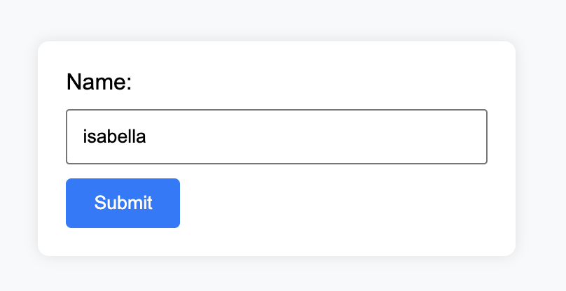
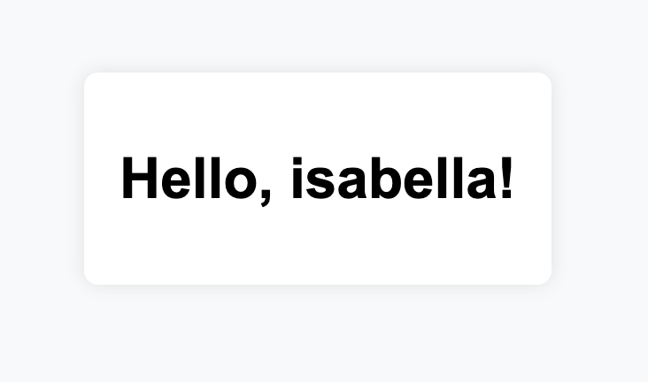
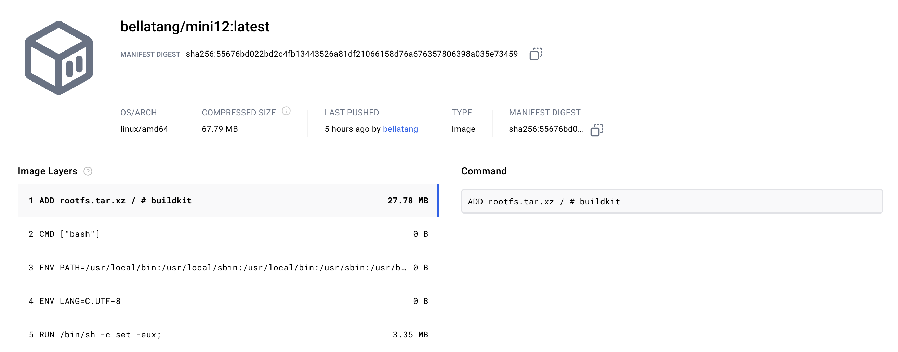

# int6_miniproject12
[](https://github.com/nogibjj/int6_miniproject12/actions/workflows/ci.yml)

## Overview  
This repository contains a simple Python Flask application, **Hello-User**, containerized with a Dockerfile. The application lets users input their name and greets them with "Hello, [Name]". The project demonstrates Docker containerization, building Docker images, and deploying them via a CI/CD pipeline to Docker Hub.

---

## Requirements  
1. Create a Python Flask application.
2. Containerize the application using Docker.
3. Run the container using `docker run` commands.
4. Build and push the Docker image to Docker Hub using a CI/CD pipeline.

---

## File Structure
```
├── .github/  
│   └── workflows/  
│       └── ci.yml  
├── main.py  
├── Dockerfile  
├── Makefile  
├── requirements.txt  
└── README.md     
```      


## Preparation
1. Ensure Docker is installed on your system.
2. Clone the repository:  
   ```bash
   git clone https://github.com/nogibjj/int6_miniproject12.git
   cd int6_miniproject12
   ```
3. Build the docker image with `make build`
4. Run the Docker container with `make run`
5. Access the Flask app by visiting http://127.0.0.1 or http://localhost

## App Functionality
1. Input your name into the text field and submit.  

2. The app displays "Hello, [Name]".  


## CI/CD Workflow
The CI/CD pipeline automates the following steps:

1. **Checkout Repository**: Pull the code.
2. **Log in to Docker Hub**: Authenticate using secrets (DOCKER_USERNAME and DOCKER_PASSWORD).
3. **Build Docker Imag**e: Build the image using the Dockerfile.
4. **Push to Docker Hub**: Publish the image for reuse.

### Setup GitHub Secrets
Add the following secrets in your GitHub repository:
* DOCKER_USERNAME: Your Docker Hub username.
* DOCKER_PASSWORD: Your Docker Hub password or access token.

### DockerHub Container Image

